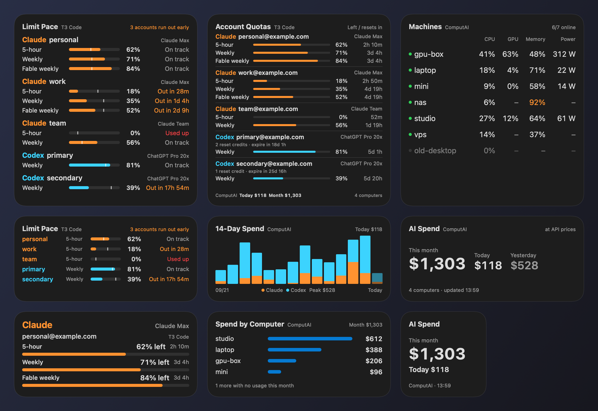

# T3 Quota Widget

Native macOS desktop widgets for the Claude and Codex accounts you use in T3 Code: how much of each quota is left, whether it will last until it resets, and, with [ComputAI](https://github.com/Sean-Hawks/computai), what your usage would cost at API prices and how your machines are doing. No menu bar item and no dashboard window.



*Rendered from the widget code with synthetic accounts and machines; not live data. Regenerate with `python3 scripts/previews.py`.*

## Widgets

| Widget | Sizes | Source | Shows |
|---|---|---|---|
| **Limit Pace** | medium, large | T3 Code | For every account, whether each window runs out before it resets at the current pace. Medium shows each account's most urgent window, large shows them all. |
| **Account Quotas** | large | T3 Code | All five accounts: plan, quota left and time to reset for every window, Codex reset credits. |
| **Claude 1–3, Codex 1–2** | medium, large | T3 Code | One account per widget, in larger type. |
| **AI Spend** | small, medium | ComputAI | This month, today and yesterday at API list prices, across every computer ComputAI reads. |
| **14-Day Spend** | medium | ComputAI | Daily Claude and Codex spend. |
| **Spend by Computer** | medium | ComputAI | This month per computer. |
| **Machines** | medium, large | ComputAI | Which machines are online, with CPU, GPU, memory and power. |

Every widget names its source beside its title. When the data is more than 15 minutes old, the summary on the right turns into an orange stale warning; the widgets never assume a quota has reset.

**How Limit Pace projects.** Each window is treated as a straight line from its start: at the average rate so far, would it reach 0% before it resets? The white mark on each bar is the share of the window still to come; a bar shorter than its mark is burning faster than time. Projections start once 5% of a window has passed. Bursty use makes them rough, so read them as a warning, not a forecast.

## Install

Requires an Apple Silicon Mac, macOS 14 or newer, Xcode and Python 3. The app is built locally and signed ad hoc; no Apple developer account is needed.

```sh
python3 scripts/build.py --install
```

Then right-click the desktop, choose **Edit Widgets**, search for **T3** and drag in the widgets you want. Gallery names are bilingual, e.g. **額度速度 · Limit Pace**.

The installer replaces this app and its background launch agent (`tw.skyhong.t3usage`). It does not modify T3 Code or stop other apps.

### Optional: ComputAI

The spend and machine widgets need [ComputAI](https://github.com/Sean-Hawks/computai) at `~/.local/bin/computai`.

- **14-Day Spend, Spend by Computer, Machines:** these read the ComputAI dashboard's `/api/state` on `127.0.0.1:8765`, so `computai --web` has to be running. Keep it running with a launch agent.
- **AI Spend:** works without the dashboard. It runs ComputAI itself at most every 5 minutes and keeps the last good result if a run fails.

Every Claude home configured in T3 (proxy accounts included) is passed to ComputAI, so all accounts on this Mac are counted. Other computers come from ComputAI's own `[machines]` settings, for example `usage = pull` over SSH.

## Language

Widgets follow the macOS language: Traditional Chinese when it comes first in Language & Region, English otherwise. To pin one:

```sh
defaults write tw.skyhong.t3usage language zh     # or en; delete the key to follow macOS again
```

The background app picks this up within 30 seconds; WidgetKit decides when the desktop redraws.

## How it works

The background app reads `~/.t3/userdata/settings.json` and `~/.t3/caches/*.json` every 30 seconds, plus ComputAI when it is available, and writes a trimmed snapshot to `/Users/Shared/T3QuotaWidget/accounts.json`. The widgets are sandboxed and can only read that one directory.

T3 Code fetches the quotas; this app never calls the providers and never spends reset credits. If T3 Code stops refreshing its cache, the quota widgets keep the last values and mark them stale.

Supported T3 instance IDs: `claude-nycu`, `claudeAgent`, `claude-cs14`, `codex-nycu`, `codex`. A cache is shown only when its driver and signed-in email match the T3 settings.

Dense widgets lay themselves out at full size first and step down evenly to 60% until they fit the space macOS gives them, so text never runs off the edge.

## Privacy

- **Credentials:** none are read or copied.
- **What the snapshot holds:** quota percentages, reset times, plan names and account labels from T3; spend totals and machine names from ComputAI.
- **What it leaves out:** project names, session timelines and prompts.
- **Where it lives:** in a directory only you can read (mode 0700).

Don't upload local caches, snapshots or screenshots that show account emails. The previews in `docs/` use synthetic accounts.

## Development

```sh
python3 -m unittest discover -s tests     # reader tests
python3 scripts/previews.py               # re-render docs/preview.png and docs/previews/*.png
```

`previews.py` compiles the widget views together with a small renderer and feeds them a synthetic snapshot. The previews therefore always match the shipping layout.

## Remove

1. Unload `tw.skyhong.t3usage` with `launchctl`.
2. Delete its plist from `~/Library/LaunchAgents`.
3. Move **T3 帳號額度 Widget.app** to the Trash.
4. Remove the widgets from the desktop with **Edit Widgets**.
5. Delete `/Users/Shared/T3QuotaWidget`.

## License

[MIT License](LICENSE).
