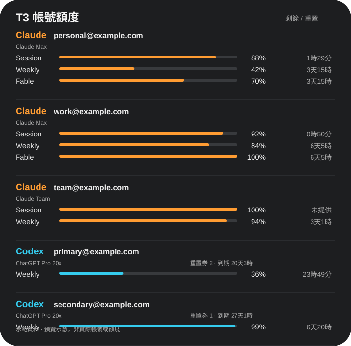

# T3 Quota Widget

A native macOS desktop WidgetKit widget for five T3 Code subscription accounts: three Claude instances and two Codex instances. No menu bar item or separate dashboard window.

Displays remaining session/weekly/model quota, subscription plan, reset countdowns, and Codex reset-credit count and next expiry when provided by T3. Expired timestamps show pending update; the widget never assumes that quotas have reset. Source timestamps and stale-data labels distinguish cached data from current provider data.

## Individual account widgets

Version 1.2.1 provides five fixed-account widgets: Claude 1/2/3 and Codex 1/2. Choose the account tile directly in the widget gallery; no edit menu or App Intents metadata is required. Both medium and large sizes are supported. Mapping follows the source IDs listed below, not quota ranking. The old configurable single-account kind was removed; replace those loading tiles with the new fixed-account tiles. The original overview remains available.

## Preview



Illustrative preview with synthetic accounts and quotas; not a screenshot of live account data.

## Build and install

Requires an Apple Silicon Mac, macOS 14 or newer, Xcode and Python 3. Built locally with ad-hoc signing; no Apple developer identity is required for this tested local installation.

```sh
python3 scripts/build.py --install
```

Then right-click the desktop → Edit Widgets → search T3 → add the large **T3 五帳號額度** widget.

The host reads `~/.t3/userdata/settings.json` and `~/.t3/caches/*.json` every 30 seconds. WidgetKit controls actual rendering frequency. This tool does not fetch provider quotas itself or spend reset credits; T3 Code must update its cache. The refresh schedule is not a guarantee of fresh provider data.

Instance IDs currently supported: `claude-nycu`, `claudeAgent`, `claude-cs14`, `codex-nycu`, `codex`. Account names are read from local settings. A cache must match both the configured driver and authenticated email before displaying its quotas, plan, or reset credits.

Only quota metadata is published to `/Users/Shared/T3QuotaWidget/accounts.json`, in a directory restricted to the current user (mode 0700). The sandboxed extension has read-only access to this specific directory. No credentials are copied. Do not upload local cache files, account snapshots or screenshots containing account identities.

The installer replaces this app and its background launch agent. It does not modify T3 Code or terminate other apps. A previously installed independent dashboard is separate and is not removed by this installer.

## Spend from ComputAI (optional)

If [ComputAI](https://github.com/Sean-Hawks/computai) is installed at `~/.local/bin/computai`, search the widget gallery for **AI 花費** (small or medium) to add this month's and today's spend as its own tile. The overview widget also adds one line: today's and this month's spend at API list prices, how many machines it covers, and `+ 未計價` when some models have no price yet. Without ComputAI the line is hidden and nothing else changes.

**額度速度** (medium, large) needs only T3: for all five accounts it projects each window in a straight line from the window start and shows whether it runs out before it resets. Medium shows each account's most urgent window, large shows every window.

When the ComputAI dashboard is running (`computai --web`, on 127.0.0.1:8765), three more widgets read its `/api/state` every 30 seconds:

| Widget | Sizes | Shows |
|---|---|---|
| 14 天花費 | medium | daily Claude and Codex spend for the last 14 days |
| 各機器花費 | medium | this month's spend per computer |
| 機器 | medium, large | each machine online or not, with CPU, GPU, memory and power |

Only machine and device names, totals and limit percentages are published; project names and the session timeline are dropped. Without the dashboard, AI 花費 falls back to running ComputAI directly, at most every 5 minutes; the result is cached in `~/Library/Application Support/T3UsageDesktop/spend.json` and the last good value is kept when a run fails. Every Claude home configured in T3 (including proxy accounts) is passed to it, so all accounts on this Mac are counted. Other machines come from ComputAI's own `[machines]` settings, for example `usage = pull` over SSH.

## Data sources and language

Every widget names its data source next to its title: **T3 Code** for quotas and pace, **ComputAI** for spend and machines. When the data is more than 15 minutes old, the summary on the right turns into an orange stale warning. The gallery names are bilingual and each description starts with the source.

Widgets are in Traditional Chinese by default. Switch to English, or follow the macOS language, with:

```sh
defaults write tw.skyhong.t3usage language en     # or zh, or auto
```

The background app picks it up on its next sync (within 30 seconds); WidgetKit decides when the desktop redraws.

## Validation

```sh
python3 -m unittest discover -s tests
```

## Remove

Unload `tw.skyhong.t3usage` with launchctl, remove its plist from `~/Library/LaunchAgents`, and move the app to Trash. Remove desktop widgets through Edit Widgets. Local quota data can then be removed from `/Users/Shared/T3QuotaWidget`.

## License

[MIT License](LICENSE).
